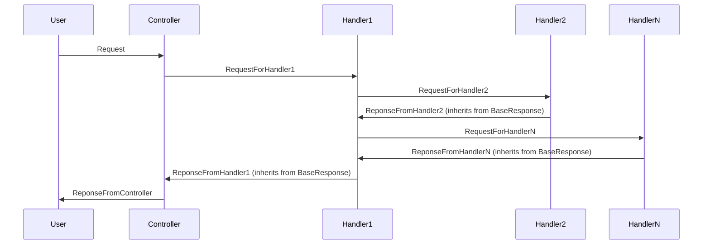

# MediatorExample

Тестовый проект с использованием паттерна Medator

## Пример диаграммы последовательности запроса от пользователя

## Организация файлов
1. Application
   - ControllerName (Название папки по имени контроллера)
     - Handlers [Обработчики запросов от mediator] [namespace appname.Handlers]
        - HandlerName (Название обработчика по имени метода контроллера)
     - Mappers [Мапперы] [namespace appname.Mappers]
        - MapperName (Название_запроса_Mapper)
     - Requests [Запросы] [namespace appname.Requests]
        - RequestName (Название_метода_Request)
     - Responses [Ответы] [namespace appname.Responses]
        - RequestName (Название_метода_Response)
     - Validators [Валидаторы] [namespace appname.Validators]
        - ValidatorName (Название_запроса_Validator)
     - MediatorSender [partial class] методы Send запросов в handler'ы для медиатора
2. Controllers (контроллеры - endpoints, задача методов контроллера сформировать запрос к медиатору и отдать ответ пользователю)
3. Services (Сервисы - общие классы, в которых нет обработчиков, например CacheProvider)
